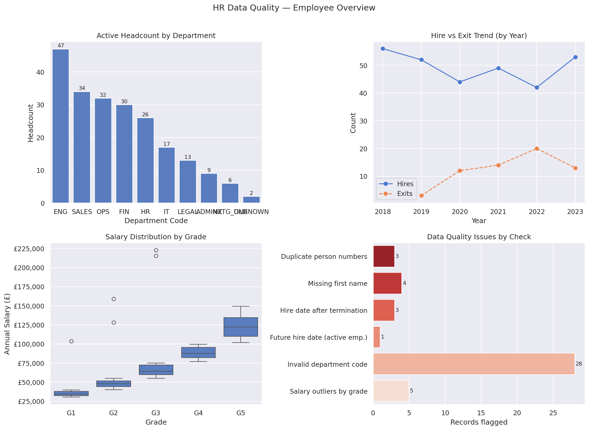

# HR Data Quality Analyser

I worked as an Oracle Fusion HCM consultant, mostly doing data migrations using HDL (HCM Data Loader). And one thing that never changed across any project — the source data was always messy.

Clients would export employee records from their old system and hand them over, and almost every time there were problems. Duplicate person numbers. Names missing. Hire dates that somehow came after termination dates. Employees mapped to department codes that hadn't been set up in the new environment yet. We'd catch these during SIT/UAT, but it was always a manual process — open the file, scan through rows, flag things in a spreadsheet, send back to the client to fix, wait, repeat.

I built this notebook to automate that process. It takes an employee dataset, runs the checks I used to do by hand, and outputs a clean list of flagged records with the reason for each one.

---

## Output Preview



The 4-panel chart shows: active headcount by department, hire vs exit trend over time, salary distribution by grade, and a summary of how many records each data quality check flagged.

---

## Dataset

I started by looking at the [IBM HR Analytics Employee Attrition dataset on Kaggle](https://www.kaggle.com/datasets/pavansubhasht/ibm-hr-analytics-attrition-dataset) to understand what HR data analysis typically covers. But that dataset doesn't reflect what migration data actually looks like — there are no person IDs, no date fields, no department codes or assignment records. It's built for attrition prediction, not data quality work.

So I created a synthetic dataset that mirrors the structure of HDL files I actually worked with — `person_number`, `hire_date`, `termination_date`, `department_code`, `grade`, `annual_salary` — and seeded it with realistic errors based on what I kept finding in real projects. The dataset generates automatically when you run the notebook.

---

## What it checks

- **Duplicate person numbers** — same ID on multiple rows, causes silent failures in HDL
- **Missing first name** — required field in Oracle HCM, blank = load error
- **Date logic errors** — hire date after termination date, or future hire dates on active employees
- **Invalid department codes** — employees mapped to codes not in the approved reference list
- **Salary outliers by grade** — flags values more than 2 standard deviations from the grade mean
- **Probation period tracking** — active employees still within their 6-month window

At the end it exports a `flagged_records.csv` with every issue listed by person number — the kind of file I'd send back to a client before go-live.

---

## How to run it

```bash
git clone https://github.com/your-username/hr-data-quality-analyser.git
cd hr-data-quality-analyser
pip install -r requirements.txt
jupyter notebook hr_data_quality.ipynb
```

No external data file needed — the dataset is generated in the first section of the notebook. If you want to use your own CSV, replace the data generation block with `df = pd.read_csv("your_file.csv")` and make sure the column names match.

---

## Stack

pandas, numpy, matplotlib, seaborn — nothing fancy, just the basics.

---

## What this doesn't handle (yet)

A few things that come up in real Oracle HCM migrations that aren't in this version:

**Effective dating** — HCM is date-effective, so a proper duplicate check needs to look for overlapping date ranges on the same person number, not just exact matches on the ID. That's a more complex check that I want to add.

**Dynamic department validation** — Right now the valid department codes are hardcoded. In a real project you'd pull that list from the HCM setup or from a reference HDL load. A better version of this would take a second input file for the reference data.

**HDL error log parsing** — After a failed load, Oracle generates a `.out` file with row-level errors. Being able to read that file and map errors back to the original source rows automatically would save a lot of time. That's the next thing I want to build out.
